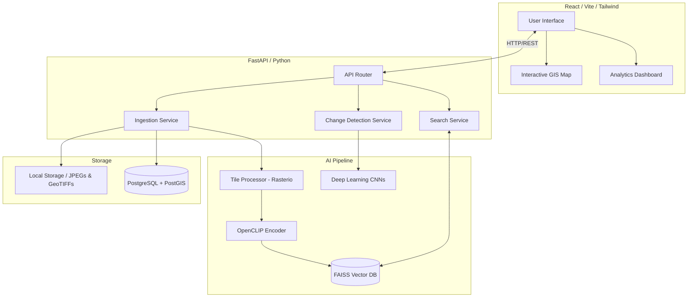

# Comprehensive Project Report
## AI Multi-Temporal Satellite Change Intelligence Platform

**Hackathon:** Smart India Hackathon (SIH) 2024  
**Problem Statement ID:** SIH1518  
**Ministry / Organization:** Ministry of Defence (MoD) / DGIS  
**Domain:** Space Technology, Artificial Intelligence, Geographic Information Systems (GIS)  

---

## 1. Executive Summary
The **AI Multi-Temporal Satellite Change Intelligence Platform** is a highly scalable, robust, and AI-powered web platform designed to automate the extraction of actionable intelligence from raw satellite imagery. By combining Deep Learning (Semantic Segmentation & Contrastive Language-Image Pretraining) with high-performance geospatial data processing, the platform eliminates the need for manual image analysis. It provides defense analysts with instant change detection capabilities and a natural-language semantic search engine for the rapid discovery of critical infrastructural and topographical assets.

## 2. Introduction & Problem Statement
### 2.1 Background
With the proliferation of earth observation satellites, terabytes of high-resolution imagery are captured daily. However, the manual analysis of this data by human operators is extremely slow, labor-intensive, and prone to cognitive fatigue.

### 2.2 The Problem
Defense and strategic intelligence agencies (like DGIS) require the ability to rapidly identify changes in terrain, infrastructure, and asset deployments over time. Existing GIS software is often clunky, requires specialized training, and lacks native AI integration. There is a critical need for an automated system that can autonomously flag structural changes and allow operators to search vast image archives using natural language.

## 3. Proposed Solution
We developed a unified, dark-themed command-center platform featuring two core AI engines:
1. **Automated Change Detection:** An AI pipeline that compares two registered GeoTIFF images from different timestamps and highlights areas of structural change using bounding boxes and heatmaps.
2. **Semantic Discovery Engine:** A "Google-like" search engine for satellite images, allowing operators to type queries like *"military convoys"* or *"new buildings near the river"* and instantly retrieve matching image tiles.

## 4. Technical Architecture

The platform utilizes a decoupled microservices architecture to ensure high availability and scalability.

## 5. Technology Stack
* **Frontend:** React.js, Vite, Tailwind CSS, Lucide Icons, Mapbox/Leaflet.
* **Backend:** Python 3.11, FastAPI, Uvicorn, Pydantic.
* **Geospatial Processing:** Rasterio, Shapely, GDAL, PROJ.
* **Artificial Intelligence:** PyTorch, OpenCLIP (Vision-Language embeddings).
* **Vector Database:** FAISS (Facebook AI Similarity Search).
* **Relational Database:** PostgreSQL with PostGIS extension.
* **Deployment:** Docker, Docker Compose, Nginx.

## 6. Core Modules & Algorithms

### 6.1 Data Ingestion & Tiling Pipeline
Satellite imagery is uploaded as massive GeoTIFF or COG (Cloud Optimized GeoTIFF) files. The backend extracts geospatial metadata (EPSG codes, bounding boxes) and slices the multi-gigabyte raster into manageable `256x256` pixel chips. These chips are persisted to disk to serve as rapid UI thumbnails.

### 6.2 Semantic Search Engine (Zero-Shot Retrieval)
* **Algorithm:** Contrastive Language-Image Pretraining (CLIP).
* **Process:** The system processes the `256x256` image chips through an `open_clip` encoder to extract 512-dimensional vector embeddings. These vectors are indexed in FAISS.
* **Retrieval:** When a user types a natural language query, it is encoded into a text vector. FAISS performs an L2/Cosine similarity search, retrieving the nearest image vectors in `<100ms`, regardless of the database size.

### 6.3 Change Detection Engine
* **Algorithm:** Siamese Convolutional Neural Networks (CNNs) / Vision Transformers (ViTs).
* **Process:** The system ingests Image A (Time 1) and Image B (Time 2). Both images are passed through the deep learning model to generate feature maps. The difference between these feature maps is calculated to produce a segmentation mask, highlighting areas of change.

## 7. Data Flow

1. **Upload:** User uploads a GeoTIFF via the UI.
2. **Pre-processing:** FastAPI receives the file, hashes it for idempotency, and stores it in `/data/storage`.
3. **Extraction:** Rasterio reads the CRS and slices the image into tiles.
4. **Embedding:** PyTorch generates embeddings for each tile.
5. **Indexing:** Embeddings are appended to the FAISS index; JPEGs are cached for static serving.
6. **Query:** User enters a search term in the UI.
7. **Response:** Backend queries FAISS, applies metadata filters (e.g., date range, sensor type), and returns ranked URLs.
8. **Render:** React frontend renders the tiles via the static FastAPI route.

## 8. Hardware & Deployment Requirements
* **Development/Local:** 
  * CPU: 8+ Cores
  * RAM: 16GB Minimum (32GB Recommended for heavy GeoTIFFs)
  * GPU: Optional for local, but highly recommended for fast PyTorch inference (NVIDIA CUDA support).
* **Production Deployment:**
  * Dockerized via `docker-compose.yml`.
  * Multi-stage builds to optimize heavy C++ GIS libraries.

## 9. User Interface (UI/UX)
The interface is intentionally designed as a dark-mode "command center" to reduce eye strain for operators working in low-light tactical environments.
* **Glassmorphism:** Subtle blur effects and clean layouts.
* **Real-time Feedback:** Loaders, latency metrics (e.g., "72.5 ms"), and similarity percentages are displayed on every search result.
* **Interactive Grid:** A highly responsive masonry grid for rendering search tiles.

## 10. Potential Use Cases & Applications
1. **Defense & Intelligence:** Monitoring enemy troop movements, border infrastructure development, and naval asset tracking.
2. **Disaster Management:** Rapidly assessing damage by comparing pre- and post-earthquake/flood satellite imagery.
3. **Urban Planning:** Tracking illegal encroachments and urban sprawl over years.
4. **Environmental Monitoring:** Detecting deforestation, mining activities, and agricultural yield changes.

## 11. Future Scope
* **Generative AI Integration:** Implementing a conversational LLM agent that allows analysts to "talk to the map" (e.g., *"Summarize the changes in Sector 4 over the last month"*).
* **Cloud Object Storage:** Migrating the local `/data/storage` folder to AWS S3 or MinIO to enable infinite horizontal scaling of image datasets.
* **Distributed AI Inference:** Offloading the PyTorch embedding generation to GPU-accelerated worker queues (Celery/Redis) to process entire planetary scenes in parallel.

## 12. Conclusion
The SIH1518 AI Multi-Temporal Satellite Change Intelligence Platform successfully bridges the gap between raw spatial data and actionable strategic intelligence. By democratizing satellite analysis through natural language search and automated deep learning pipelines, the platform empowers decision-makers to respond to global events with unprecedented speed and accuracy.
